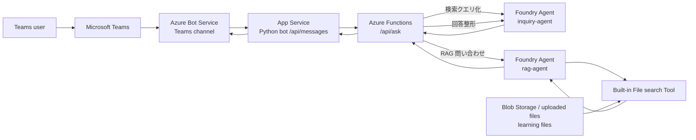

# Azure Teams RAG Bot Study

Teams でユーザがボットに話しかけると、Azure Bot Service 経由で App Service 上の Bot が受け取り、Azure Functions を呼び出します。Function は Microsoft Foundry Agent Service の `inquiry-agent` で質問を検索向けに整え、`rag-agent` に問い合わせます。`rag-agent` は Foundry 組み込みの File search Tool で Blob Storage 由来の情報を検索し、最後に `inquiry-agent` が Teams 向けの回答へ整形します。

## 重要な前提

- 2026-07-01 時点の Microsoft Learn では、Bot Framework SDK は GitHub 上で archived 扱いで、サポートチケット対応は 2025-12-31 に終了と案内されています。学習用に Azure Bot Service / App Service の疎通を体験する目的でこの構成にしています。本番や長期運用では Microsoft 365 Agents SDK / Teams SDK も検討してください。
- Foundry Agent Service は 2026-06 更新のドキュメントで、Prompt agents / Hosted agents / Responses API / File search を中心に説明されています。このサンプルは Prompt agent、Responses API、組み込み File search Tool を使います。
- 最終構成では Teams の Entra ID テナントと Azure リソースの Entra ID テナントが別になる想定です。そのため、Foundry 呼び出しは Managed Identity 固定ではなく、Azure リソース側テナントの App registration / service principal で認証できるようにしています。
- 認証情報は 2 系統に分けます。`MicrosoftAppId` / `MicrosoftAppPassword` は Teams Bot 用、`AZURE_CLIENT_ID` / `AZURE_CLIENT_SECRET` は Foundry 呼び出し用です。
- 今回の主目的は Azure の理解なので、リソース作成は Azure Portal / Foundry portal で行う前提です。詳細手順は [docs/portal-steps.md](/Users/koyanagi/azure_study/docs/portal-steps.md) にあります。

## リポジトリ構成

- [app-service-bot/](/Users/koyanagi/azure_study/app-service-bot): Teams/Bot Service からの Activity を受ける App Service 用 Bot。
- [function-app/](/Users/koyanagi/azure_study/function-app): Bot から呼ばれる HTTP Trigger。Foundry の `inquiry-agent` と `rag-agent` を実行。
- [teams-app/manifest.json](/Users/koyanagi/azure_study/teams-app/manifest.json): Teams にアップロードするアプリ manifest の雛形。
- [data/knowledge/sample.md](/Users/koyanagi/azure_study/data/knowledge/sample.md): 動作確認用のナレッジファイル。

## 最短の疎通順

1. Azure Portal で Resource Group、Storage Account、Function App、App Service、Azure Bot を作成します。
2. Azure Portal で Blob Storage の container を作り、学習用ファイルをアップロードします。
3. Foundry portal で Foundry project、モデル deployment、`rag-agent`、`inquiry-agent` を画面操作で作成します。
4. `rag-agent` に組み込み File search Tool を追加し、学習用ファイルを登録します。
5. Foundry portal の playground で `rag-agent` と `inquiry-agent` を単体テストします。
6. Azure リソース側テナントに Foundry 呼び出し用 App registration を作り、対応する service principal を確認してから Foundry project/resource へ権限を付与します。詳細は [docs/portal-steps.md](/Users/koyanagi/azure_study/docs/portal-steps.md) の `6. Foundry 呼び出し用 App registration` を参照してください。
7. `function-app` を Azure Functions にデプロイし、`FOUNDRY_PROJECT_ENDPOINT`、`FOUNDRY_AUTH_MODE=service_principal`、`AZURE_TENANT_ID`、`AZURE_CLIENT_ID`、`AZURE_CLIENT_SECRET` などを App settings に設定します。
8. Bot 用 multi-tenant App registration を作成し、Azure Bot resource に紐付けます。その後、`app-service-bot` を App Service にデプロイし、Function URL と Bot の `MicrosoftAppId` / `MicrosoftAppPassword` を App settings に設定します。
9. Azure Bot の Messaging endpoint を `https://<app-service>.azurewebsites.net/api/messages` に設定し、Teams channel を有効化します。
10. `teams-app/manifest.json` の ID を差し替えて Teams にアップロードし、Bot に話しかけます。

## 参考リンク

- [What is Microsoft Foundry Agent Service?](https://learn.microsoft.com/en-us/azure/foundry/agents/overview)
- [File search tool for agents](https://learn.microsoft.com/en-us/azure/foundry/agents/how-to/tools/file-search)
- [How Microsoft Teams bots work](https://learn.microsoft.com/en-us/azure/bot-service/bot-builder-basics-teams?view=azure-bot-service-4.0)
- [Azure Functions HTTP trigger](https://learn.microsoft.com/en-us/azure/azure-functions/functions-bindings-http-webhook-trigger?pivots=programming-language-python)
