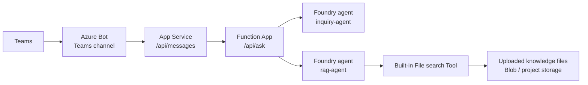

# Azure Portal 操作手順

この手順は、Azure の各リソースをブラウザで理解しながら作ることを目的にしています。Azure CLI や作成スクリプトでリソースを自動作成しません。検索は一旦 Foundry Agent Service の組み込み File search Tool に任せ、Function App は前捌きと agent 呼び出しを担当します。

## 0. 作るもの



役割は次の通りです。

- Azure Bot: Teams channel と App Service の Bot endpoint をつなぐ入口。
- App Service: Teams の Bot Activity を受ける Web アプリ。
- Function App: Bot から質問を受け、会話の前捌き、共有シークレット確認、Foundry agents の呼び出しを担当。
- Foundry `inquiry-agent`: Teams の質問を検索クエリへ整え、最後に回答文を整形。
- Foundry `rag-agent`: 組み込み File search Tool でナレッジを検索して回答候補を作成。
- Blob Storage / project storage: 学習用ファイルを保存する場所。

## 0.1. テナントと認証の前提

最終構成では、Teams 利用者が所属する Entra ID テナントと、Azure リソースを置く Entra ID テナントが別になる想定です。この場合、認証情報を混ぜないようにします。

```text
Teams 側テナント
  - Teams ユーザ
  - Teams にアップロードするアプリ
  - Teams から利用できる multi-tenant Bot app

Azure リソース側テナント
  - Resource Group / App Service / Function App / Storage / Foundry
  - Foundry 呼び出し用 App registration / service principal
```

このサンプルでは、2 種類の App registration を分けます。

- Bot 用 app: `MicrosoftAppId` / `MicrosoftAppPassword`。Teams channel と Bot Framework の認証に使います。
- Foundry 呼び出し用 app: `AZURE_CLIENT_ID` / `AZURE_CLIENT_SECRET`。Function App が Azure リソース側テナントの Foundry project を呼ぶために使います。

Managed Identity は同一 Azure テナント内の学習では便利ですが、クロステナント境界をまたぐ認証では扱いづらくなります。そのため、この手順では Foundry 呼び出しに Azure リソース側テナントの service principal を使います。

App registration と service principal の関係:

- App registration: アプリケーション定義です。`Application (client) ID` を持ちます。
- Service principal: 特定テナント内で、そのアプリが実際に権限付与される実体です。Azure RBAC の role assignment では、この service principal を member として選びます。
- Azure Portal では、作成した App registration は `Microsoft Entra ID` -> `App registrations` で確認します。対応する service principal は `Microsoft Entra ID` -> `Enterprise applications` で確認します。

## 1. Resource Group

1. [Azure Portal](https://portal.azure.com/) を開きます。
2. 検索バーで `Resource groups` を開きます。
3. `Create` を選択します。
4. 次を入力します。
   - Subscription: 自分の検証用 subscription
   - Resource group: `rg-teams-rag-bot-study`
   - Region: Foundry と App Service を置きたいリージョン
5. `Review + create` -> `Create`。

理解するポイント:

- Resource Group は、今回の学習用リソースをまとめて確認・削除する単位です。

## 2. Storage Account と Blob container

1. Azure Portal の検索バーで `Storage accounts` を開きます。
2. `Create` を選択します。
3. `Basics` で次を入力します。
   - Resource group: `rg-teams-rag-bot-study`
   - Storage account name: `stteamsragstudy<任意の数字>`
   - Region: Resource Group と同じか近いリージョン
   - Performance: `Standard`
   - Redundancy: 学習用なら `Locally-redundant storage (LRS)`
4. `Review + create` -> `Create`。
5. 作成後、Storage Account を開きます。
6. 左メニュー `Data storage` -> `Containers` を開きます。
7. `+ Container` を選択します。
8. 次を入力します。
   - Name: `knowledge`
   - Anonymous access level: `Private`
9. `knowledge` container を開き、`Upload` から学習用ファイルをアップロードします。
10. まずは [data/knowledge/sample.md](/Users/koyanagi/azure_study/data/knowledge/sample.md) の内容を `sample.md` としてアップロードすると疎通確認しやすいです。

理解するポイント:

- Blob container はファイルを置く箱です。
- この手順では Foundry File search へ同じファイルをアップロードして検索させます。Blob は「元データを置く場所」として確認します。
- 本格化する場合は、Blob から Foundry / Search へ同期する仕組みを追加します。

## 3. Microsoft Foundry project とモデル

1. Azure Portal または [Microsoft Foundry portal](https://ai.azure.com/) を開きます。
2. Foundry resource / project を作成します。
3. 作成時は次を意識します。
   - Resource group: `rg-teams-rag-bot-study`
   - Region: Agent Service と使いたいモデルが利用できるリージョン
   - Project name: `proj-teams-rag-study`
4. Project の Overview または Home で Project endpoint を控えます。

形式はおおむね次のようになります。

```text
https://<foundry-resource>.services.ai.azure.com/api/projects/<project-name>
```

5. チャット対応モデルをデプロイします。例: `gpt-5-mini`。
6. Deployment name を控えます。

理解するポイント:

- Foundry project は、モデル、agent、tool、project storage、トレースを束ねる作業場所です。
- Function App はこの Project endpoint に対して Responses API / Agent 呼び出しを行います。

## 4. `rag-agent` を Portal で作成

1. Foundry portal の project で `Build` -> `Agents` を開きます。
2. `Create agent` を選択します。
3. Agent name に `rag-agent` を入力します。
4. Model に先ほど作成した deployment を選択します。
5. Instructions に次を入力します。

```text
あなたは Azure 学習用ナレッジを検索する RAG エージェントです。
必ず File search で取得できる情報を根拠にして、日本語で簡潔に回答してください。
根拠が見つからない場合は、保存済みナレッジでは確認できないと明示してください。
推測で Azure の設定値や手順を断定しないでください。
```

6. Tool 追加画面で `File search` を追加します。
7. File search の設定で、新しい vector store / knowledge source を作ります。
8. `Add files` または `Upload files` から、Blob に置いたものと同じ学習用ファイルを登録します。
9. 画面上で indexing / ingestion が完了するまで待ちます。
10. Agent playground で次を質問します。

```text
このサンプル構成で Azure Functions は何をしますか？
```

期待する状態:

- `sample.md` の内容に沿って、Function が Foundry agents を呼ぶ中継だと回答する。
- ファイルにない質問では「確認できない」と返す。

理解するポイント:

- File search は agent に外部知識を持たせる組み込み Tool です。
- この構成では検索の実行判断と検索処理を `rag-agent` に委譲します。
- Function App は検索結果を直接扱わず、`rag-agent` の回答を受け取ります。

## 5. `inquiry-agent` を Portal で作成

1. Foundry portal の `Agents` で `Create agent` を選択します。
2. Agent name に `inquiry-agent` を入力します。
3. Model に先ほど作成した deployment を選択します。
4. Tool は追加しなくて構いません。
5. Instructions に次を入力します。

```text
あなたは Teams で利用される問い合わせ受付エージェントです。
ユーザ質問を読み取り、RAG 検索に使いやすい短い日本語クエリへ変換できます。
また、RAG 回答候補を受け取った場合は、Teams で読みやすい日本語回答へ整形します。
回答では、根拠が検索結果に含まれる範囲だけを使ってください。
検索結果に根拠がない場合は、保存済みナレッジでは確認できないと明示してください。
```

6. Playground で次を質問し、検索クエリ化できるか確認します。

```text
次の Teams ユーザ質問を、RAG 検索に適した短い検索クエリにしてください。回答文ではなく検索クエリだけを返してください。

ユーザ質問: Teams から質問した時、裏側で Azure Functions は何をしていますか？
```

期待する状態:

- `Azure Functions Teams Foundry agent RAG 中継` のような短い検索クエリが返る。

## 6. Foundry 呼び出し用 App registration

Function App から Foundry を呼び出すために、Azure リソース側テナントに App registration を作ります。これは Teams Bot 用の App ID とは別物です。

### 6.1. App registration を作成

1. Azure Portal 右上のディレクトリ切り替えで、Azure リソース側テナントを選択します。
2. 検索バーで `Microsoft Entra ID` を開きます。
3. `App registrations` -> `New registration` を選択します。
4. 次を入力します。
   - Name: `app-foundry-caller-teams-rag-study`
   - Supported account types: `Accounts in this organizational directory only`
   - Redirect URI: 未設定
5. 作成後、`Application (client) ID` と `Directory (tenant) ID` を控えます。
6. `Certificates & secrets` -> `New client secret` を選択します。
7. 期限を選んで作成し、secret の `Value` を控えます。

控える値:

```text
AZURE_TENANT_ID=<Directory (tenant) ID>
AZURE_CLIENT_ID=<Application (client) ID>
AZURE_CLIENT_SECRET=<client secret の Value>
```

### 6.2. Service principal を確認

1. Azure リソース側テナントの `Microsoft Entra ID` を開きます。
2. `Enterprise applications` を開きます。
3. 検索欄で `app-foundry-caller-teams-rag-study` を検索します。
4. 見つかった Enterprise application を開きます。
5. `Object ID` を確認します。これは service principal の object ID です。

補足:

- 通常、App registration を作成すると同じテナント内に対応する service principal も作成されます。
- Role assignment で検索しても見つからない場合は、数分待ってから再検索します。
- `Application (client) ID` と `Object ID` は別物です。App settings に入れるのは `Application (client) ID`、RBAC で選ばれる実体は service principal です。

### 6.3. Foundry 側 RBAC を付与

1. Azure Portal で Foundry resource、Foundry project、または Foundry が属する resource group を開きます。
2. `Access control (IAM)` を開きます。
3. `Add` -> `Add role assignment` を選択します。
4. Role を選びます。学習用なら、まず Foundry project/resource で agent 実行に必要なロールを選びます。画面に Foundry 系ロールが表示される場合は、最小権限に寄せて選択します。
5. `Members` で `User, group, or service principal` を選択します。
6. `Select members` で `app-foundry-caller-teams-rag-study` を検索します。
7. 見つかった service principal を選択します。
8. `Review + assign` を選択します。

動作確認の見方:

- `Access control (IAM)` -> `Role assignments` で `app-foundry-caller-teams-rag-study` が表示されれば、Foundry 呼び出し用 service principal に RBAC が付いています。
- Function App のログで認証エラーが出る場合、まず `AZURE_TENANT_ID`、`AZURE_CLIENT_ID`、`AZURE_CLIENT_SECRET`、RBAC の付与対象を確認します。

Function App の App settings では次のように使います。

```text
FOUNDRY_AUTH_MODE=service_principal
AZURE_TENANT_ID=<Directory tenant ID>
AZURE_CLIENT_ID=<Application client ID>
AZURE_CLIENT_SECRET=<client secret value>
```

理解するポイント:

- Teams Bot 用 app と Foundry 呼び出し用 app は分けます。
- `AZURE_TENANT_ID` は Azure リソース側テナントの ID です。Teams 側テナントの ID ではありません。
- Managed Identity を使う場合は `FOUNDRY_AUTH_MODE=managed_identity` にできますが、クロステナント前提では service principal の方が明示的です。

## 7. Function App を Portal で作成

1. Azure Portal の検索バーで `Function App` を開きます。
2. `Create` を選択します。
3. `Basics` で次を入力します。
   - Resource group: `rg-teams-rag-bot-study`
   - Function App name: `func-teams-rag-study-<任意>`
   - Runtime stack: `Python`
   - Python version: Azure Functions がサポートする 3.11 以降
   - Region: Foundry と同じか近いリージョン
4. Hosting は学習用なら Consumption / Flex Consumption 系で構いません。
5. `Review + create` -> `Create`。
6. `Configuration` -> `Application settings` に次を追加します。

```text
FOUNDRY_PROJECT_ENDPOINT=https://<foundry-resource>.services.ai.azure.com/api/projects/<project-name>
FOUNDRY_AUTH_MODE=service_principal
AZURE_TENANT_ID=<Azure リソース側テナント ID>
AZURE_CLIENT_ID=<Foundry 呼び出し用 App registration の client ID>
AZURE_CLIENT_SECRET=<Foundry 呼び出し用 client secret>
INQUIRY_AGENT_NAME=inquiry-agent
RAG_AGENT_NAME=rag-agent
BOT_FUNCTION_SHARED_SECRET=<任意の長いランダム文字列>
```

7. `Overview` で Function App を再起動します。

理解するポイント:

- `FOUNDRY_PROJECT_ENDPOINT` は Function が Foundry project を呼ぶ宛先です。
- `BOT_FUNCTION_SHARED_SECRET` は App Service Bot から Function を呼ぶ時の簡易的な共有シークレットです。
- `AZURE_CLIENT_ID` は Foundry 呼び出し用 app の ID です。Bot の `MicrosoftAppId` とは別です。

## 8. Function App にコードを配置

リソースは Portal で作成します。コード配置もブラウザで行うなら、次のどちらかを使います。

方法 A: Deployment Center

1. Function App の `Deployment Center` を開きます。
2. GitHub などのソースを接続します。
3. `function-app` ディレクトリをデプロイ対象にします。
4. デプロイ後、`Functions` に `ask` が表示されることを確認します。

方法 B: Advanced Tools / Kudu

1. Function App の `Advanced Tools` を開きます。
2. `Go` を選択して Kudu を開きます。
3. Zip deploy 画面、または Debug console から `function-app` の内容を配置します。
4. `requirements.txt` が Function App 側で認識され、Python package が復元されることを確認します。

配置後の確認:

1. Function App の `Functions` -> `ask` を開きます。
2. `Get function URL` で URL を控えます。
3. `Code + Test` または `Test/Run` が使える場合は、次の JSON を POST します。

```json
{
  "text": "この構成で Azure Functions は何をしますか？"
}
```

4. Header に次を追加します。

```text
x-bot-shared-secret: <BOT_FUNCTION_SHARED_SECRET と同じ値>
```

期待する状態:

- HTTP 200 で `answer` が返る。
- Function App の `Log stream` に Foundry agent 呼び出しが出る。

## 9. App Service を Portal で作成

1. Azure Portal の検索バーで `App Services` を開きます。
2. `Create` を選択します。
3. 次を入力します。
   - Resource group: `rg-teams-rag-bot-study`
   - Name: `app-teams-rag-bot-<任意>`
   - Publish: `Code`
   - Runtime stack: `Python`
   - Region: Function App と同じか近いリージョン
4. Pricing plan は学習用の小さい SKU を選びます。
5. `Review + create` -> `Create`。
6. 作成後、`Configuration` -> `Application settings` に次を追加します。

```text
MicrosoftAppId=<Azure Bot の Microsoft App ID>
MicrosoftAppPassword=<Azure Bot の client secret>
FUNCTION_ASK_URL=https://<function-app>.azurewebsites.net/api/ask
BOT_FUNCTION_SHARED_SECRET=<Function App と同じ値>
```

7. `General settings` または `Configuration` の Startup command に次を設定します。

```text
python app.py
```

## 10. App Service に Bot コードを配置

ブラウザで配置する場合:

1. App Service の `Deployment Center` を開きます。
2. GitHub などのソースを接続します。
3. `app-service-bot` ディレクトリをデプロイ対象にします。
4. 代替として `Advanced Tools` / Kudu から `app-service-bot` の内容を配置します。
5. `Log stream` を開き、起動エラーがないことを確認します。
6. ブラウザで次を開きます。

```text
https://<app-service>.azurewebsites.net/healthz
```

期待する状態:

```json
{"status": "ok"}
```

## 11. Azure Bot を Portal で作成

この手順では、Teams 側テナントから利用できる Bot 用 App registration を明示的に作成してから Azure Bot に紐付けます。Azure Bot 作成画面で自動作成することもできますが、クロステナント学習では先に App registration を作った方が理解しやすいです。

### 11.1. Bot 用 App registration を作成

1. Azure Portal 右上のディレクトリ切り替えで、Bot を管理するテナントを選択します。通常は Azure Bot resource を作成する Azure リソース側テナントです。
2. 検索バーで `Microsoft Entra ID` を開きます。
3. `App registrations` -> `New registration` を選択します。
4. 次を入力します。
   - Name: `app-teams-rag-bot`
   - Supported account types: `Accounts in any organizational directory`
   - Redirect URI: 未設定
5. 作成後、`Application (client) ID` を控えます。これが App Service の `MicrosoftAppId` と Teams manifest の `bots[0].botId` になります。
6. `Certificates & secrets` -> `New client secret` を選択します。
7. 期限を選んで作成し、secret の `Value` を控えます。これが App Service の `MicrosoftAppPassword` になります。
8. `Overview` で `Supported account types` が multi-tenant になっていることを確認します。

控える値:

```text
MicrosoftAppId=<Bot 用 Application (client) ID>
MicrosoftAppPassword=<Bot 用 client secret の Value>
```

### 11.2. Bot 用 service principal を Teams 側テナントで確認

Teams 側テナントでアプリを利用すると、そのテナントにも Bot 用 app の service principal が作成されます。管理者同意が必要な組織では、この確認が重要です。

1. Azure Portal 右上のディレクトリ切り替えで、Teams 側テナントを選択します。
2. `Microsoft Entra ID` -> `Enterprise applications` を開きます。
3. `app-teams-rag-bot`、または Bot 用 `Application (client) ID` で検索します。
4. 見つからない場合は、Teams へのアプリ追加、または管理者同意がまだ行われていない可能性があります。

理解するポイント:

- Bot 用 App registration は multi-tenant です。
- Azure リソース側テナントに app registration があり、Teams 側テナントには enterprise application / service principal として現れます。
- Foundry 呼び出し用 app は single tenant でよく、Teams 側テナントには出す必要がありません。

### 11.3. Azure Bot resource を作成

1. Azure Portal 右上のディレクトリ切り替えで、Azure リソース側テナントを選択します。
2. Azure Portal の検索バーで `Azure Bot` を開きます。
3. `Create` を選択します。
4. 次を入力します。
   - Bot handle: `bot-teams-rag-study-<任意>`
   - Resource group: `rg-teams-rag-bot-study`
   - Pricing tier: 学習用の tier
   - Microsoft App ID: `Use existing app registration` を選び、11.1 で作成した Bot 用 `Application (client) ID` を指定します。
5. 作成後、Bot の `Configuration` を開きます。
6. Messaging endpoint に次を設定します。

```text
https://<app-service>.azurewebsites.net/api/messages
```

7. App Service の App settings に、11.1 で控えた `MicrosoftAppId` と `MicrosoftAppPassword` を設定します。
8. App Service を再起動します。

理解するポイント:

- Bot 用 App ID は Teams / Bot Connector との通信に使います。
- Foundry 呼び出し用の `AZURE_CLIENT_ID` とは別です。
- Teams 側テナントのユーザが使うため、Bot 用 app は multi-tenant として扱います。

## 12. Teams channel を有効化

1. Azure Bot の `Channels` を開きます。
2. `Microsoft Teams` を選択します。
3. 利用条件や cloud 種別を確認して保存します。
4. Channel が有効になったことを確認します。

## 13. Teams app manifest

1. [teams-app/manifest.json](/Users/koyanagi/azure_study/teams-app/manifest.json) を開きます。
2. 次を差し替えます。
   - `id`: Teams app 用の GUID
   - `bots[0].botId`: Azure Bot の Microsoft App ID
   - `validDomains[0]`: App Service のドメイン。例: `app-teams-rag-bot.azurewebsites.net`
   - `developer`: 組織ポリシーに合わせた URL
3. `manifest.json`、`color.png`、`outline.png` を zip の直下に入れます。
4. Teams の `Apps` -> `Manage your apps` -> `Upload an app` からアップロードします。
5. Bot を個人スコープに追加します。

## 14. Teams から疎通確認

Teams で Bot に次のように話しかけます。

```text
この構成で Azure Functions は何をしますか？
```

順番に確認します。

1. Teams に typing 表示が出る。
2. App Service の `Log stream` に `/api/messages` へのアクセスが出る。
3. Function App の `Log stream` に `/api/ask` へのアクセスが出る。
4. Foundry portal の traces / monitoring で `inquiry-agent` と `rag-agent` の呼び出しを確認する。
5. Teams に `rag-agent` の File search 結果に基づく回答が返る。

## 15. よくある詰まりどころ

- Teams で応答がない: Azure Bot の Messaging endpoint、Teams channel、App Service の起動ログを確認します。
- App Service が 401 を返す: `MicrosoftAppId` と `MicrosoftAppPassword` を確認します。
- Function が 401 を返す: `BOT_FUNCTION_SHARED_SECRET` が App Service と Function App で一致しているか確認します。
- Function が Foundry を呼べない: `AZURE_TENANT_ID` が Azure リソース側テナントか、`AZURE_CLIENT_ID` / `AZURE_CLIENT_SECRET` が Foundry 呼び出し用 app の値か、Foundry 側 RBAC が付いているか確認します。
- Teams 側別テナントで Bot が使えない: Bot 用 App registration が multi-tenant か、Teams app manifest の `botId` が Bot 用 `MicrosoftAppId` と一致しているか確認します。
- RAG がファイルを参照しない: `rag-agent` の File search Tool、アップロードしたファイル、indexing 状態を確認します。
- Teams app package をアップロードできない: manifest の GUID、`botId`、`validDomains`、アイコン PNG、zip 直下の配置を確認します。
